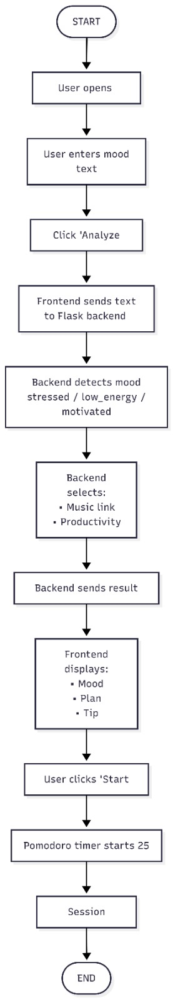

<p align="center">
  
</p>

# Mood Booster 🎯

## Basic Details

### Team Name: Spectra

### Team Members
- Member 1: Minha U - NSS COLLEGE OF ENGINEERING PALAKKAD
- Member 2: Sithara Rajendran -  NSS COLLEGE OF ENGINEERING PALAKKAD

### Hosted Project Link
[mention your project hosted link here]

### Project Description
The project is a Mood-Based Productivity and Wellness Web Application that analyzes a user’s emotional state based on their input and provides personalized productivity plans, motivational tips, mood-based music recommendations, and a built-in Pomodoro timer to improve focus and well-being.

### The Problem statement
In today’s academic and professional environments, productivity is significantly influenced by an individual’s emotional state. Stress, low motivation, and mental fatigue often reduce focus and efficiency, while most existing productivity tools fail to consider the user’s mood.

### The Solution
The project aims to develop a Mood‑Based Productivity Booster that analyzes the user’s emotional state and provides personalized recommendations, motivational support, and a Pomodoro timer to enhance focus, productivity, and overall well‑being through an interactive and user‑friendly interface.

---

## Technical Details

### Technologies/Components Used

**For Software:**
- Languages used: html, CSS , JavaScript, Python
- Frameworks used:  React
- Libraries used: [e.g., axios, pandas, JUnit]
- Tools used: [e.g., VS Code, Git, Docker]

**For Hardware:**
- Main components: [List main components]
- Specifications: [Technical specifications]
- Tools required: [List tools needed]

---

## Features

List the key features of your project:
- Feature 1: [Description]
- Feature 2: [Description]
- Feature 3: [Description]
- Feature 4: [Description]

---

## Implementation

### For Software:

#### Installation
```bash
Installation commands -  npm install, pip install -r requirements.txt
```

#### Run
```bash
npm run dev,python app.py
```

### For Hardware:

#### Components Required
[List all components needed with specifications]

#### Circuit Setup
[Explain how to set up the circuit]

---

## Project Documentation

### For Software:

#### Screenshots (Add at least 3)

image/Screenshot 2026-02-14 093321.png
*frontpage*

image/Screenshot 2026-02-14 093352.png
*music and mood*

image/Screenshot 2026-02-14 093413.png
*action plan and pomodoro timer*

#### Diagrams

**System Architecture:**

*This diagram shows how your Mood-Based Productivity App works step by step. First, the user opens the website and enters how they feel (for example, “I feel tired”). When the user clicks the “Analyze Mood” button, the frontend (React) sends this text to the Flask backend using a POST request to the /analyze API. The backend then processes the text, detects the mood (such as stressed, low energy, or motivated), and selects appropriate responses like a music link, a productivity plan, and a motivational tip. It sends this data back to the frontend in JSON format. The frontend then displays the detected mood, plan, tip, and music option to the user. If the user clicks “Start Timer,” the Pomodoro timer begins (usually 25 minutes). After the timer finishes, the session is complete.*

**Application Workflow:**


image/workflow.jpeg
*The diagram shows how your Mood-Based Productivity App works step by step. First, the user opens the website and enters how they feel (for example, “I feel tired”). When the user clicks the “Analyze Mood” button, the frontend (React) sends this text to the Flask backend using a POST request to the /analyze API. The backend then processes the text, detects the mood (such as stressed, low energy, or motivated), and selects appropriate responses like a music link, a productivity plan, and a motivational tip. It sends this data back to the frontend in JSON format. The frontend then displays the detected mood, plan, tip, and music option to the user. If the user clicks “Start Timer,” the Pomodoro timer begins (usually 25 minutes). After the timer finishes, the session is complete.*

---


---


# Example 2: With verbose output
python script.py -v input.txt

# Example 3: Specify output file
python script.py -o output.txt input.txt

# Example 4: Using configuration
python script.py -c config.json --verbose input.txt
```

#### Demo Output

**Example 1: Basic Processing**

**Input:**
```
This is a sample input file
with multiple lines of text
for demonstration purposes
```

**Command:**
```bash
python script.py sample.txt
```

**Output:**
```
Processing: sample.txt
Lines processed: 3
Characters counted: 86
Status: Success
Output saved to: output.txt
```

**Example 2: Advanced Usage**

**Input:**
```json
{
  "name": "test",
  "value": 123
}
```

**Command:**
```bash
python script.py -v --format json data.json
```

**Output:**
```
[VERBOSE] Loading configuration...
[VERBOSE] Parsing JSON input...
[VERBOSE] Processing data...
{
  "status": "success",
  "processed": true,
  "result": {
    "name": "test",
    "value": 123,
    "timestamp": "2024-02-07T10:30:00"
  }
}
[VERBOSE] Operation completed in 0.23s
```

---

## Project Demo

### Video
[Add your demo video link here - YouTube, Google Drive, etc.]

*Explain what the video demonstrates - key features, user flow, technical highlights*

### Additional Demos
[Add any extra demo materials/links - Live site, APK download, online demo, etc.]

---

## AI Tools Used (Optional - For Transparency Bonus)

If you used AI tools during development, document them here for transparency:

**Tool Used:** [e.g., GitHub Copilot, v0.dev, Cursor, ChatGPT, Claude]

**Purpose:** [What you used it for]
- Example: "Generated boilerplate React components"
- Example: "Debugging assistance for async functions"
- Example: "Code review and optimization suggestions"

**Key Prompts Used:**
- "Create a REST API endpoint for user authentication"
- "Debug this async function that's causing race conditions"
- "Optimize this database query for better performance"

**Percentage of AI-generated code:** [Approximately X%]

**Human Contributions:**
- Architecture design and planning
- Custom business logic implementation
- Integration and testing
- UI/UX design decisions

*Note: Proper documentation of AI usage demonstrates transparency and earns bonus points in evaluation!*

---

## Team Contributions

- [Name 1]: [Specific contributions - e.g., Frontend development, API integration, etc.]
- [Name 2]: [Specific contributions - e.g., Backend development, Database design, etc.]
- [Name 3]: [Specific contributions - e.g., UI/UX design, Testing, Documentation, etc.]

---

## License

This project is licensed under the [LICENSE_NAME] License - see the [LICENSE](LICENSE) file for details.

**Common License Options:**
- MIT License (Permissive, widely used)
- Apache 2.0 (Permissive with patent grant)
- GPL v3 (Copyleft, requires derivative works to be open source)

---

Made with ❤️ at TinkerHub
